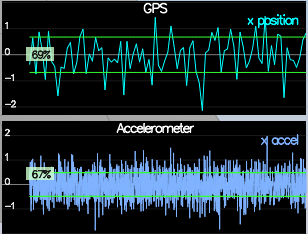
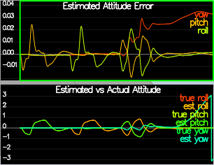
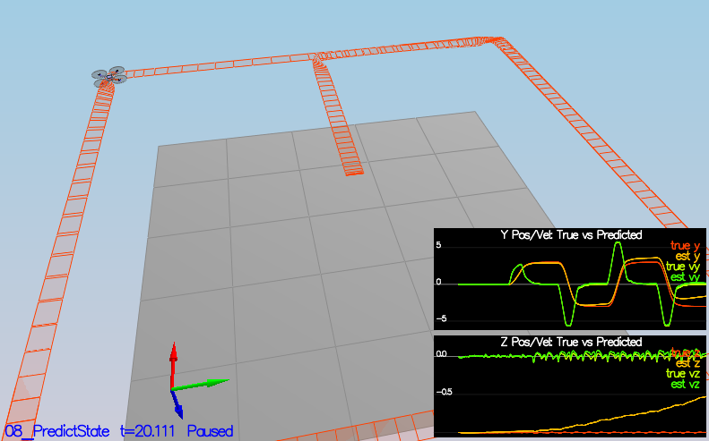
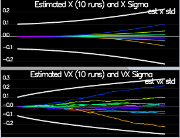
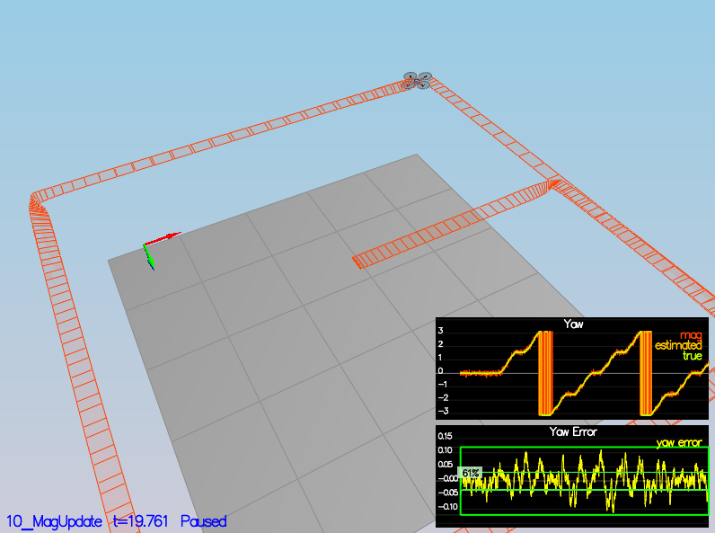
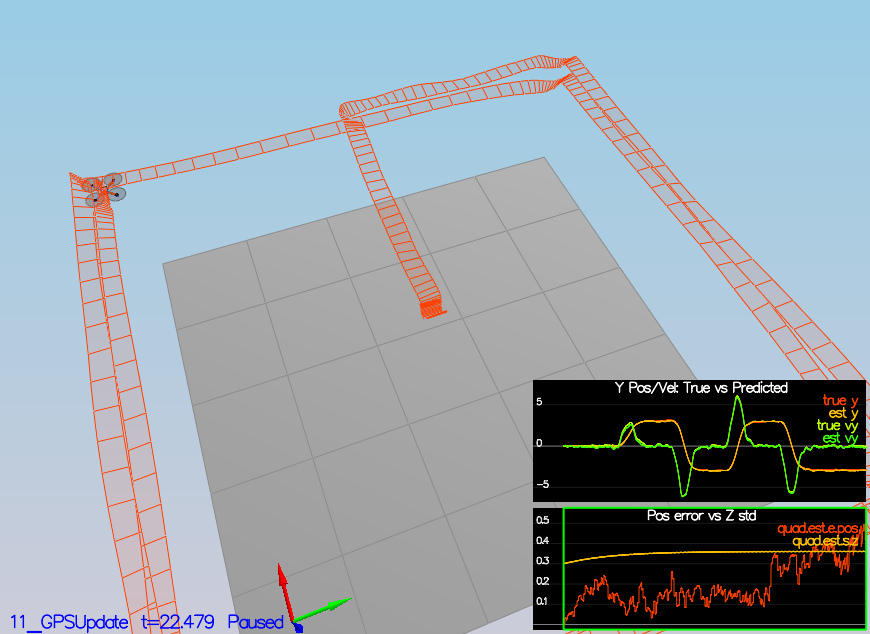

# Building an Estimator


## Implementation details


### Determine the standard deviation of the measurement noise of both GPS X data and Accelerometer X data.

The process of determining the standard deviation was to record measurements from GPS and accelerometer with drone sitting still on the ground for 10 seconds, and then prosess that with Matlab to get the standard deviation from each sensor.

```matlab
%% Load data
accel = readtable(strcat("config/log/Graph2.txt"));
gps = readtable(strcat("config/log/Graph1.txt"));

%% Calculate standard deviation
std_accel = std(accel.Quad_IMU_AX);
std_gps = std(gps.Quad_GPS_X);
```

### Implement a better rate gyro attitude integration scheme in the UpdateFromIMU() function.

Attitude estimation is performed by integrating IMU measurements in an non-linear complementary filter.
Code can be found in function `UpdateFromIMU`, where changes by me is described below how the integration is performed. The delta angle from the IMU measurements are added to the previous estimated attitude angles with the yaw angle normalized in the range `[-pi, pi]`. The integrated rotation is then passed to the complementary filter seen in `UpdateFromIMU`.

```cpp
// Non-linear Complementary filter
Quaternion<float> q = Quaternion<float>::FromEuler123_RPY(rollEst, pitchEst, ekfState(6));
Quaternion<float> dq = Quaternion<float>::FromEuler123_RPY(gyro.x*dtIMU, gyro.y*dtIMU, gyro.z*dtIMU);
Quaternion<float> predictedQ = dq * q;

float predictedRoll = predictedQ.Roll();
float predictedPitch = predictedQ.Pitch();
ekfState(6) = predictedQ.Yaw();

// normalize yaw to -pi .. pi
if (ekfState(6) > F_PI) ekfState(6) -= 2.f*F_PI;
if (ekfState(6) < -F_PI) ekfState(6) += 2.f*F_PI;

```

### Implement all of the elements of the prediction step for the estimator.

Predict next timestep in `PredictState` using previous state and acceleration measurements as control inputs.

```cpp
// Rotate acceleration measurements to the inertial frame
V3F accelInertial = attitude.Rotate_BtoI(accel);

// Integrate state predictions
predictedState(0) = curState(0)  + curState(3) * dt;                             // Position x
predictedState(1) = curState(1)  + curState(4) * dt;                             // Position y
predictedState(2) = curState(2)  + curState(5) * dt;                             // Position z
predictedState(3) = curState(3)  + accelInertial.x  * dt;                        // Velocity x
predictedState(4) = curState(4)  + accelInertial.y  * dt;                        // Velocity y
predictedState(5) = curState(5)  + (accelInertial.z - (float)CONST_GRAVITY)*dt;  // Velocity z
predictedState(6) = predictedState(6);                                           // Yaw

```

The partial derivative of the rotation matrix is found in `GetRbgPrime`

```cpp
// Pre-calculate to avoid unnecessary calculations later
float sinRoll   = sin(roll);
float cosRoll   = cos(roll);
float sinPitch  = sin(pitch);
float cosPitch  = cos(pitch);
float sinYaw    = sin(yaw);
float cosYaw    = cos(yaw);

RbgPrime << -cosPitch*sinYaw, -sinRoll*sinPitch*sinYaw - cosRoll*cosYaw, -cosRoll*sinPitch*sinYaw + sinRoll*cosYaw,
            cosPitch*cosYaw, sinRoll*sinPitch*cosYaw - cosRoll*sinYaw, cosRoll*sinPitch*cosYaw + sinRoll*sinYaw,
            0, 0, 0;
```

Covariance update is found in  `Predict`, where gPrime is the Jacobian.
```cpp
VectorXf u(3);
u << accel.x, accel.y, accel.z;

gPrime(0,3) = dt;
gPrime(1,4) = dt;
gPrime(2,5) = dt;
gPrime(3,6) = RbgPrime.row(0).dot(u) * dt;
gPrime(4,6) = RbgPrime.row(1).dot(u) * dt;
gPrime(5,6) = RbgPrime.row(2).dot(u) * dt;

ekfCov = gPrime * ekfCov * gPrime.transpose() + Q;
```


### Implement the magnetometer update.


Code can be found in function `UpdateFromMag`, where changes by me is found below. The measurement model is set to only measure the yaw state, and making sure that the updated value is normalized in the range `[-pi, pi]`.

```cpp
hPrime(0, 6) = 1.f;
zFromX(0) = ekfState(6);

float yawError = ekfState(6) - magYaw;
if (yawError > F_PI) zFromX(0) -= 2.f * F_PI;
if (yawError < -F_PI) zFromX(0) += 2.f * F_PI;

```

### Implement the GPS update.

Code can be found in function `UpdateFromGPS`, where changes by me is found below. The meaurement model is set to measure position and velocity.

```cpp
hPrime.setIdentity();
zFromX(0) = ekfState(0);
zFromX(1) = ekfState(1);
zFromX(2) = ekfState(2);
zFromX(3) = ekfState(3);
zFromX(4) = ekfState(4);
zFromX(5) = ekfState(5);

```


## Flight Evaluation


### Sensor Noise
Measured standard deviation from horizontal GPS position was found to be 0.6767m, while the accelerometer standard deviation was found to be 0.4838 m/s^2. This is verified in the figure below where all measurements are within the one sigma bound with drone still on the ground.




### Attitude Estimation
Validation of the non-linear complementary filter is shown below, where the attitude error is less than 0.1 rad for each of the Euler angles.



### Predict State
In the figure below we can see how the estimator performs when only using an ideal IMU for position estimation. Since the perfect IMU is without noise, we get quite good results, and can verify than the prediction step works. 



### Predict Covariance
The process noise is tuned such that the covariance follow the variation in the data.



### Magnetometer Update 
In the next figure a magnetometer is added where the yaw error is less than 0.1 rad.




### GPS Update
In this last figure a GPS is added as measurement updates and the IMU use a more realistic noise model. In addition, this step use a controller implemented in a previous project and tuned to perform well in this scenario. As shown below, the position error is less then 1m.

